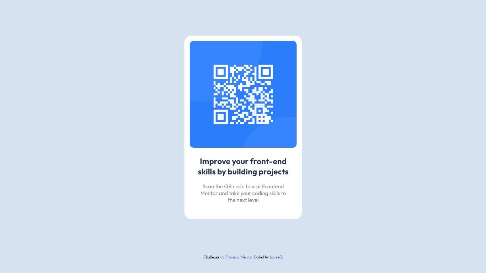

# Frontend Mentor - QR code component solution

This is a solution to the [QR code component challenge on Frontend Mentor](https://www.frontendmentor.io/challenges/qr-code-component-iux_sIO_H). Frontend Mentor challenges help you improve your coding skills by building realistic projects. 

## Table of contents

- [Overview](#overview)
  - [Screenshot](#screenshot)
  - [Links](#links)
- [My process](#my-process)
  - [Built with](#built-with)
  - [What I learned](#what-i-learned)
  - [Continued development](#continued-development)
  - [Useful resources](#useful-resources)
- [Author](#author)
- [Acknowledgments](#acknowledgments)


## Overview

### Screenshot




### Links

- Solution URL: [Solution](https://github.com/iamyeff/challenge1.git)
- Live Site URL: [Add live site URL here](https://your-live-site-url.com)

## My process

### Built with

- Semantic HTML5 markup
- CSS custom properties
- [Styled Components](https://fonts.google.com/specimen/Outfit) - For styles


### What I learned


```css
.abc { 
          background-color: hsl(0, 0%, 100%); 
          text-align: center;
          position: relative; 
          display: block;
          block-size: 15%;
          border-radius: 20px; 
          width: 300px;
          margin-top: 100px;
          margin-left: auto;
          margin-right: auto;
          margin-bottom: 100px;
          padding: 15px;
          padding-bottom: 30px;
          font-family: "Outfit", sans-serif;
          font-size: 15px;
        }
```

### Continued development

:)

### Useful resources

- (https://www.freecodecamp.org/espanol/news/como-centrar-un-div-con-css-10-maneras-diferentes/) - This helped me because i didn't remember how center a div (xd).

## Author

- Email - [Yeferson Montaño](yefer253@gmail.com)
- Frontend Mentor - [@yiamyeff](https://www.frontendmentor.io/profile/iamyeff)


## Acknowledgments

It's good remember the basic programming concepts. This proyect is easy but i had many time searching how center a div for myself.

